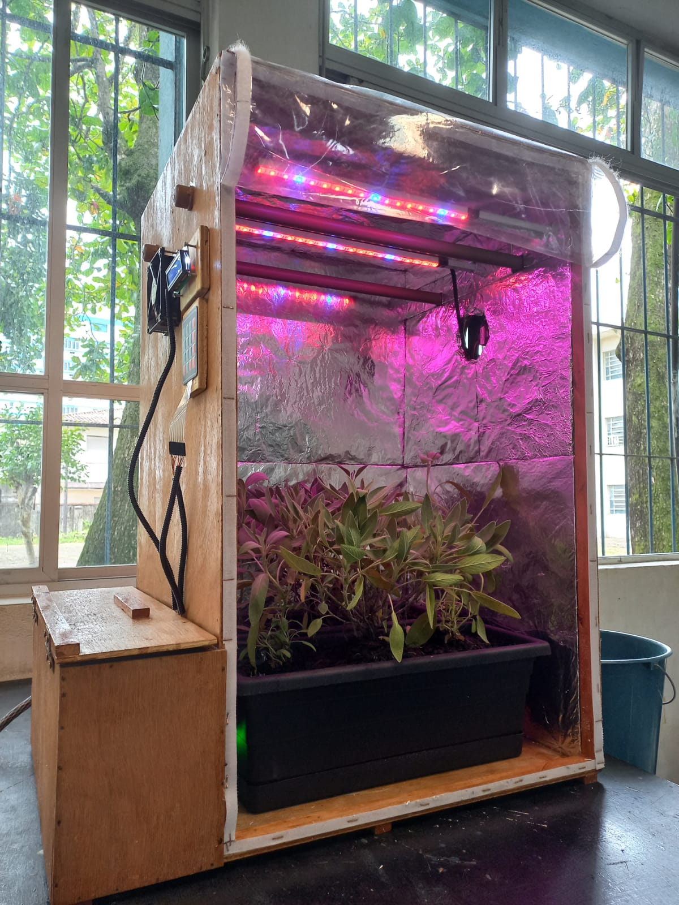

# 
Estufa para Ambientes Internos

## Este é o Trabalho de Conclusão de Curso do meu curso Técnico em Eletrônica, concluído em 2021 na instituição de ensino ETEC Aristóteles Ferreira, em Santos-SP

 
  

### Linguagens e ferramentas utilizadas:

### Integrantes e suas funções:
Letícia da Silva Campos - Elaboração do código e do circuito elétrico.

Gustavo Fonseca Aragão Rodrigues - Construção da estrutura física da estufa.

Pedro Henrique dos Santos - Confecção da parte escrita.
  
### Resumo:
O projeto visa contribuir com informações, exemplos e discussões a respeito do cultivo indoor de plantas e hortaliças, o que nos traz inúmeros benefícios como a prática da fitoterapia, alimentação sem agrotóxicos e a promoção do contato humano com a natureza, seja para fins comerciais ou não. Traçando paralelos com a eletrônica, a estufa une a tecnologia com uma prática há muito disseminada pela humanidade. Considerando pesquisas nessa área, correlaciona com pesquisas de botânica, que é o ramo da biologia que estuda o reino Plantae. Com isso apresenta, portanto, um pequeno ambiente monitorado e condicionado para que diversas plantas de pequeno porte possam ser cultivadas em locais que seriam impróprios, como apartamentos, onde há pouca ou nenhuma incidência de luz solar, além de protegê-las contra mudanças climáticas, doenças e pragas. Através deste trabalho, buscamos contornar o problema da falta de espaço adequado para o plantio. Com o controle ambiente oferecido e a vantagem do uso de vasos, podemos moldar grande parte dos fatores que definem o sucesso do cultivo. Assim, qualquer indivíduo pode desfrutar do que a jardinagem tem a nos oferecer.
Palavras-chave: CULTIVO; PLANTAS; ESTUFA; MONITORADO;

